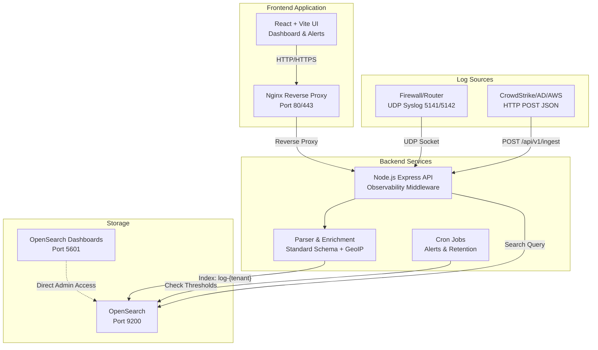

# Log Management System Architecture

This document describes the system architecture and data flow of the Centralized Log Management system.

## Architecture Diagram

## Data Flow

1. **Ingestion Layer**
   - The system receives log data through two primary channels:
     - **Syslog (UDP):** Network devices send data to ports 5141 and 5142. The backend opens UDP sockets to receive logs and identifies tenants based on the designated port.
     - **HTTP POST:** Software or applications (e.g., AWS, Microsoft Active Directory, CrowdStrike) send JSON-formatted data to the `/api/v1/ingest` endpoint.

2. **Normalization and Enrichment Layer**
   - All log data passes through the parser service to restructure it into a central schema, enforcing mandatory fields such as `@timestamp`, `tenant`, `event_type`, `source`, `user`, and `src_ip`.
   - **Enrichment:** The system automatically resolves the `src_ip` using the GeoIP database (`geoip-lite`) to append country and city information to the logs.
   - **Observability:** An Express middleware tracks and logs the execution latency of each API request, which is utilized for time complexity analysis.

3. **Storage Layer (True Multi-Tenant Architecture)**
   - The backend evaluates the tenant of each log and stores it in OpenSearch using dynamic indexing based on the tenant (e.g., `log-demoa`, `log-demob`) to guarantee data isolation and security.

4. **Query and Visualization Layer**
   - Users access the system via the React-based frontend interface.
   - Access is restricted using Role-Based Access Control (RBAC). For instance, if a user logs in as a `viewer` for `demoA`, the backend limits the search scope strictly to the `log-demoa` index, preventing cross-tenant data access.

5. **Background Jobs**
   - **Alerting Cron:** Runs every 1 minute to query the database against security thresholds (e.g., `login_failed` > 5 times). If violations are detected, an alert record is generated.
   - **Retention Cron:** Runs every midnight to delete logs older than 7 days, managing storage capacity and complying with data retention policies.

6. **Infrastructure as Code (IaC)**
   - To support automated and scalable cloud deployments, the project includes a complete Terraform configuration (`terraform/main.tf`).
   - This setup dynamically provisions an AWS EC2 instance, configures the required security group policies, and bootstraps the Docker environment via a User Data script, ensuring a reproducible production environment in under 5 minutes.
