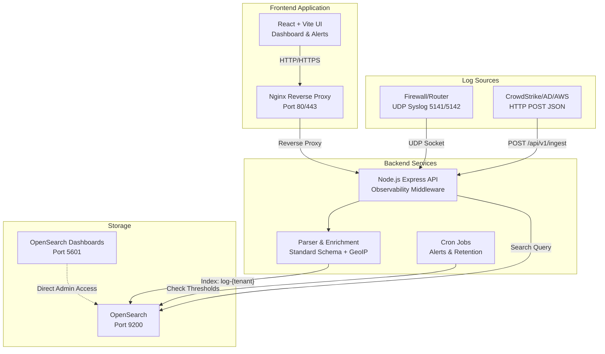

# สถาปัตยกรรมระบบ Log Management

เอกสารฉบับนี้อธิบายถึงสถาปัตยกรรมระบบและโครงสร้างการไหลของข้อมูล (Data Flow) ของระบบจัดการและจัดเก็บ Log แบบรวมศูนย์ (Centralized Log Management)

## แผนภาพสถาปัตยกรรม (Architecture Diagram)

## การไหลของข้อมูล (Data Flow)

1. **ชั้นรับข้อมูล (Ingestion Layer)**
   - ระบบรับข้อมูล Log ผ่าน 2 ช่องทางหลัก:
     - **Syslog (UDP):** อุปกรณ์เครือข่ายส่งข้อมูลมาที่พอร์ต 5141/5142 โดยระบบ Backend จะเปิด UDP Sockets รอรับและแยกแยะ Tenant ตามพอร์ตที่กำหนดไว้
     - **HTTP POST:** ซอฟต์แวร์หรือแอปพลิเคชัน (เช่น AWS, Microsoft Active Directory, CrowdStrike) ส่งข้อมูลในรูปแบบ JSON มาที่ Endpoint `/api/v1/ingest`
2. **ชั้นประมวลผลและเพิ่มพูนข้อมูล (Normalization & Enrichment Layer)**
   - ข้อมูล Log ทั้งหมดจะถูกส่งผ่าน Parser Service เพื่อปรับโครงสร้างให้อยู่ในรูปแบบมาตรฐาน (Central Schema) โดยบังคับให้มีฟิลด์สำคัญ เช่น `@timestamp, tenant, event_type, source, user, src_ip`
   - **การเพิ่มพูนข้อมูล (Enrichment):** ระบบจะทำการแปลง `src_ip` ด้วยฐานข้อมูล GeoIP (`geoip-lite`) เพื่อเพิ่มข้อมูลประเทศและเมืองเข้าไปใน Log โดยอัตโนมัติ
   - **การตรวจสอบประสิทธิภาพ (Observability):** ระบบมี Express Middleware เพื่อตรวจสอบและบันทึกเวลาที่ใช้ในการประมวลผล (Execution Latency) ของแต่ละ API Request เพื่อใช้ในการวิเคราะห์ความซับซ้อนของอัลกอริทึม (Time Complexity)
3. **ชั้นจัดเก็บข้อมูล (Storage Layer - True Multi-tenant Architecture)**
   - Backend จะประเมิน Tenant ของแต่ละ Log และจัดเก็บลงใน OpenSearch โดยใช้หลักการสร้าง Index แบบพลวัต (Dynamic Indexing) ตาม Tenant (เช่น `log-demoa`, `log-demob`) เพื่อรับประกันการแยกส่วนและรักษาความปลอดภัยของข้อมูล
4. **ชั้นสอบถามและแสดงผลข้อมูล (Query & Visualization Layer)**
   - ผู้ใช้เข้าใช้งานผ่านหน้าจอ Frontend ที่พัฒนาด้วย React
   - ระบบมีการควบคุมสิทธิ์การเข้าถึงแบบ Role-Based Access Control (RBAC) หากผู้ใช้ล็อกอินในฐานะ `viewer` ของ `demoA` ระบบ Backend จะจำกัดขอบเขตการค้นหาไว้ที่ Index `log-demoa` เท่านั้น ป้องกันการเข้าถึงข้อมูลข้าม Tenant โดยเด็ดขาด
5. **ระบบทำงานเบื้องหลัง (Background Jobs)**
   - **Alerting Cron:** ทำงานทุก 1 นาที เพื่อตรวจสอบฐานข้อมูลเทียบกับเงื่อนไขด้านความปลอดภัย (เช่น login_failed > 5 ครั้ง) หากพบการละเมิดจะสร้างบันทึกการแจ้งเตือน
   - **Retention Cron:** ทำงานทุกเที่ยงคืน เพื่อลบ Log ที่มีอายุเกิน 7 วัน เพื่อบริหารจัดการพื้นที่จัดเก็บและให้สอดคล้องกับนโยบายการเก็บรักษาข้อมูล